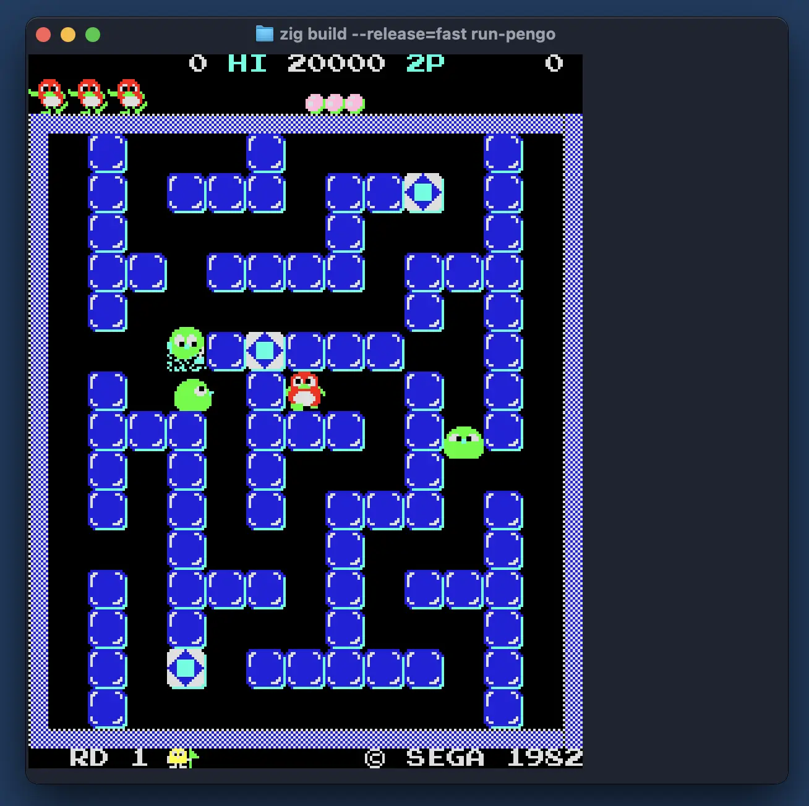

## chipz in the terminal

A little proof-of-concept to run an 8-bit emulator in a terminal
via the Kitty Graphics Protocol:



Tested in Ghostty and Kitty on macOS.

## Build and Run

Currently requires `Zig 0.13.0` (because of libvaxis dependency).

In Ghostty or Kitty terminal:

```
zig build --release=fast run-pengo
```

## Usage

Press `1` or `F1` to insert a coin, and `Enter` to start.

In the game: `Arrow Keys` for direction and `Space` to push an ice block.

`Ctrl-C` to quit.

## Dependencies:

- [libvaxis](https://github.com/rockorager/libvaxis) for rendering
- [chipz](https://github.com/floooh/chipz) for the emulator core
- [sokol-audio](https://github.com/floooh/sokol-zig) for the sound

## References:

Uses code snippets from:

- https://github.com/cryptocode/terminal-doom

Kitty Graphics Protocol:

- https://sw.kovidgoyal.net/kitty/graphics-protocol/

Ghostty:

- https://ghostty.org/
